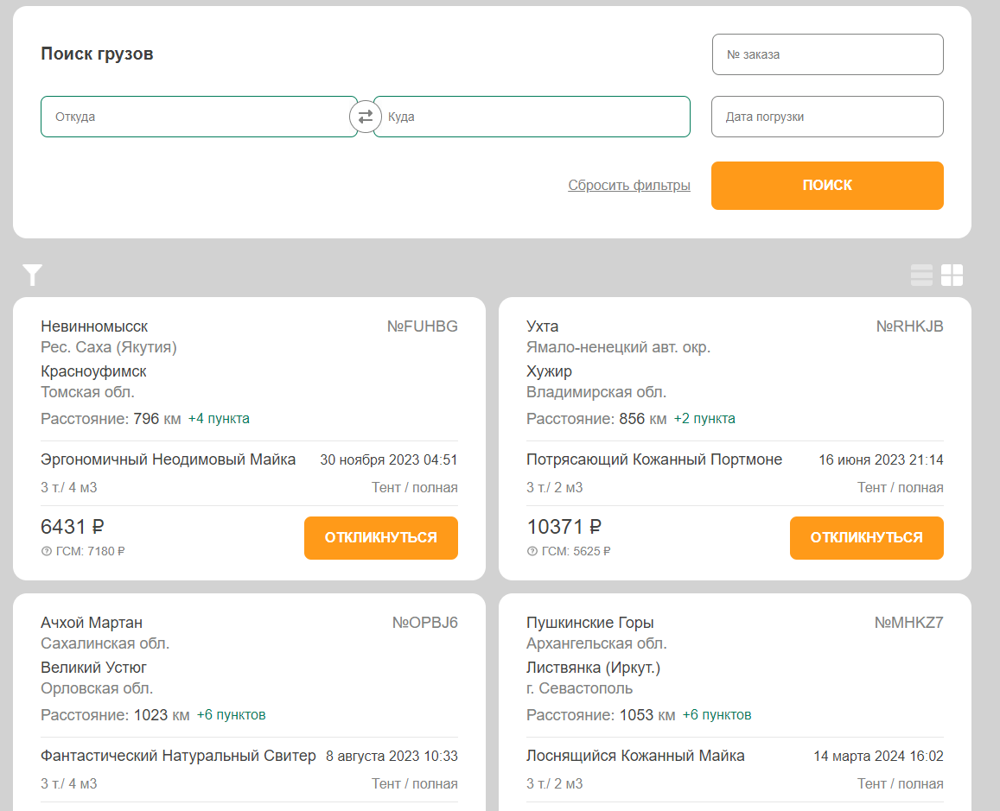

# vite + react + ts + rtk + scss iteco

Веб-приложение по поиску заказов для перевозок транспортной компании.
Сайт: https://kirill-k88.github.io/vite-react-ts-rtk-scss-iteco/
Стек: React, TS, SCSS, RTK, TanStack Query, React Virtuoso, Formik, Yup ...

Скриншот:

## Работа с приложением:

- Запуск при разработке: npm run dev

- Запуск проверки ESLint: npm run lint

- Билд: npm run build
